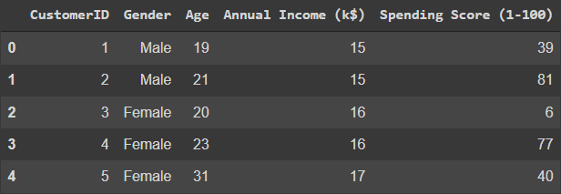
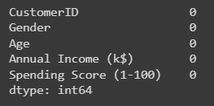
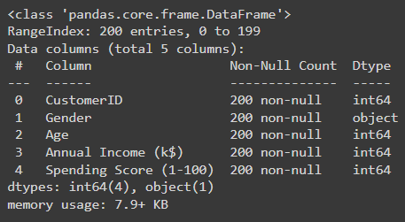
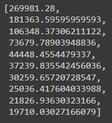
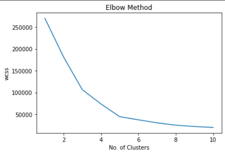
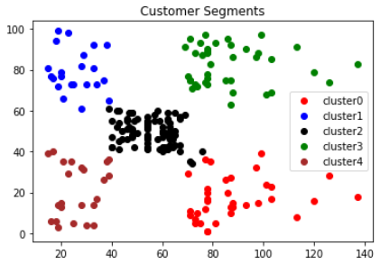

# Implementation-of-K-Means-Clustering-for-Customer-Segmentation

## AIM:
To write a program to implement the K Means Clustering for Customer Segmentation.

## Equipments Required:
1. Hardware – PCs
2. Anaconda – Python 3.7 Installation / Moodle-Code Runner

## Algorithm
1. Import the necessary packages using import statement.
2. Read the given csv file using read_csv() method and print the number of contents to be displayed using df.head().
3. Import KMeans and use for loop to cluster the data. 
4. Predict the cluster and plot data graphs.
5. Print the outputs and end the program

## Program:
```
/*
Program to implement the K Means Clustering for Customer Segmentation.
Developed by: SAKTHIVEL R
RegisterNumber:  2122210400141
*/
```

```py
import pandas as pd
import matplotlib.pyplot as plt

data = pd.read_csv("Mall_Customers.csv")
data.head()

data.info()

data.isnull().sum()

from sklearn.cluster import KMeans
wcss = [] 
#WCSS stands for Withitn Cluster Sum of Square. It is sum of squared distance each point and centroid in the cluster.

for i in range(1,11):
    kmeans = KMeans(n_clusters = i,init = "k-means++")
    kmeans.fit(data.iloc[:,3:])
    wcss.append(kmeans.inertia_)
wcss

plt.plot(range(1,11),wcss)
plt.xlabel("No. of Clusters")
plt.ylabel("wcss")
plt.title("Elbow Method")

km = KMeans(n_clusters = 5)
km.fit(data.iloc[:,3:])
y_pred = km.predict(data.iloc[:,3:])
data["cluster"] = y_pred

df0 = data[data["cluster"]==0]
df1 = data[data["cluster"]==1]
df2 = data[data["cluster"]==2]
df3 = data[data["cluster"]==3]
df4 = data[data["cluster"]==4]

plt.scatter(df0["Annual Income (k$)"],df0["Spending Score (1-100)"],c="red",label="cluster0")
plt.scatter(df1["Annual Income (k$)"],df1["Spending Score (1-100)"],c="yellow",label="cluster1")
plt.scatter(df2["Annual Income (k$)"],df2["Spending Score (1-100)"],c="pink",label="cluster2")
plt.scatter(df3["Annual Income (k$)"],df3["Spending Score (1-100)"],c="green",label="cluster3")
plt.scatter(df4["Annual Income (k$)"],df4["Spending Score (1-100)"],c="purple",label="cluster4")
plt.legend()
plt.title("Customer Segments")
```

## Output:
### Data Head:

### Checking Data:

### Data Information:

### WCSS - Withitn Cluster Sum of Square:

### Plot - Elbow Method:

### Cluster:



## Result:
Thus the program to implement the K Means Clustering for Customer Segmentation is written and verified using python programming.
